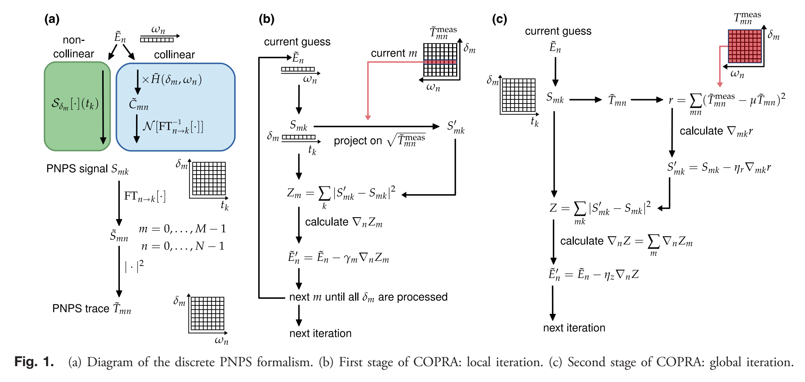
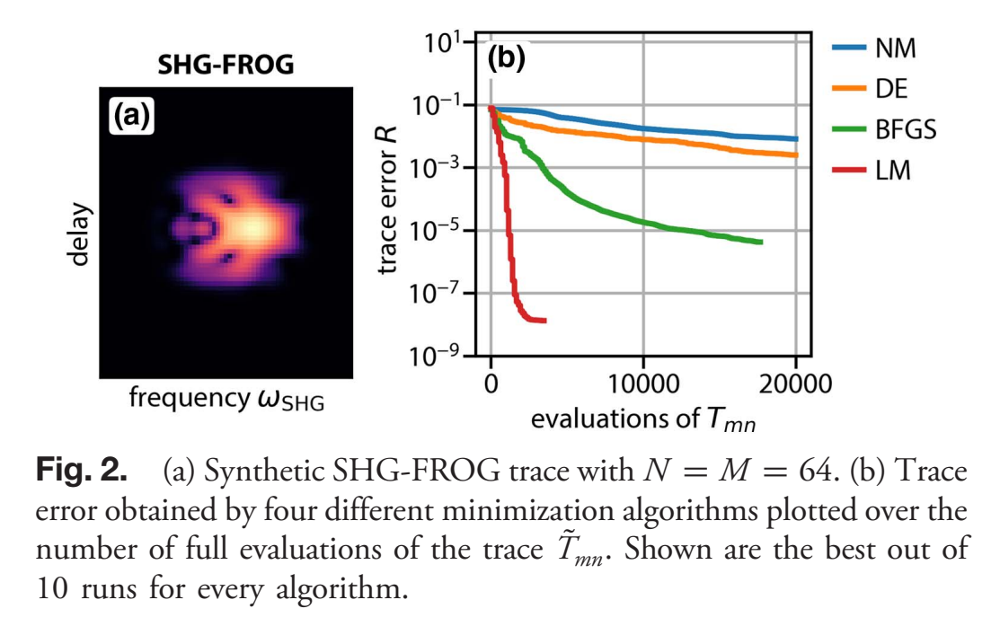
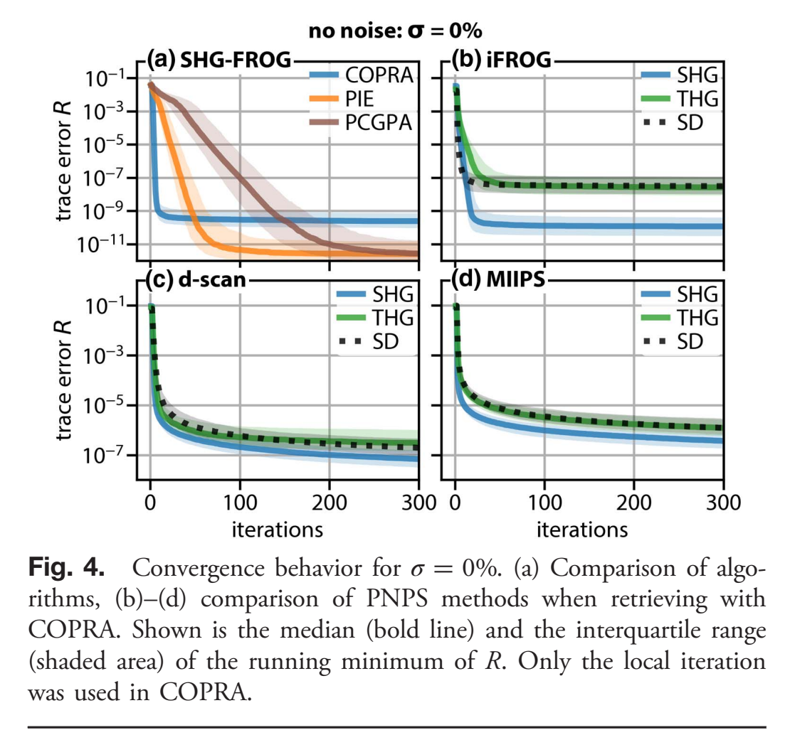
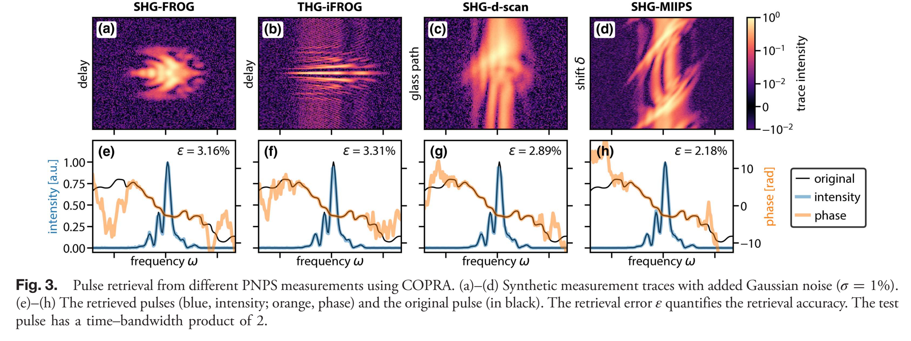
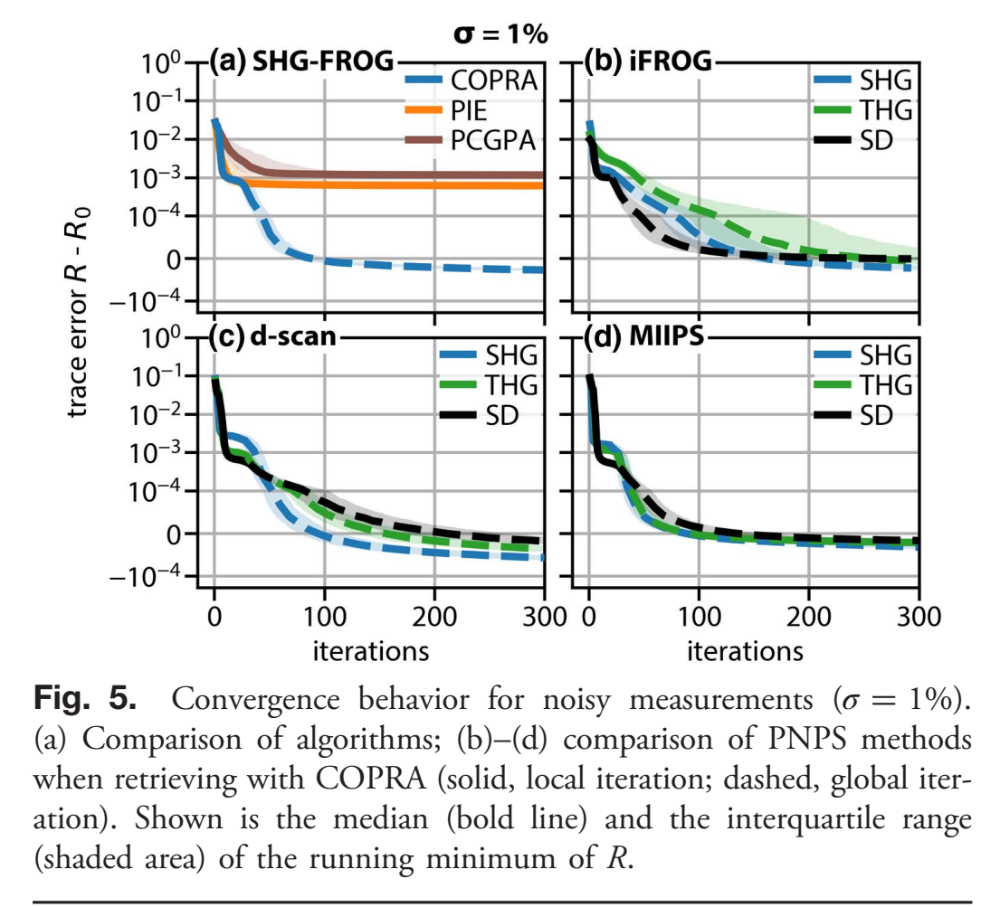
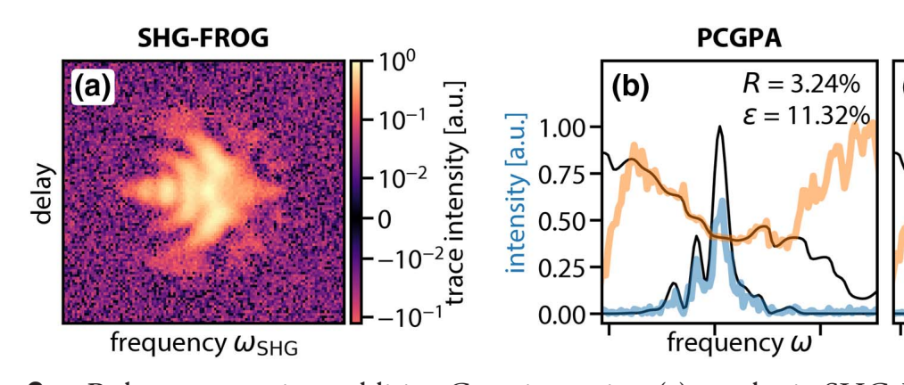
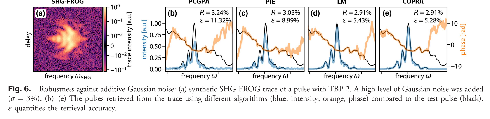
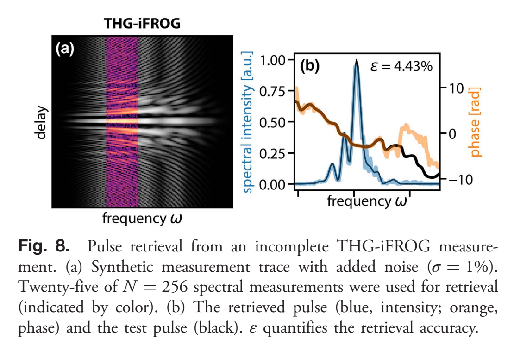

<!-- source: pdf page 1 -->
optica

# Common pulse retrieval algorithm: a fast and universal method to retrieve ultrashort pulses

NILS C. GEIB,1,* MATTHIAS ZILK,1 THOMAS PERTSCH,1,2,3 AND FALK EILENBERGER1,2,3

1Institute of Applied Physics, Abbe Center of Photonics, Friedrich Schiller University, Albert-Einstein-Str. 15, 07745 Jena, Germany 2Fraunhofer Institute for Applied Optics and Precision Engineering IOF, Center for Excellence in Photonics, Albert-Einstein-Str. 7, 07745 Jena, Germany 3Max Planck School of Photonics, Germany ib@

Received 8 October 2018; revised 11 March 2019; accepted 11 March 2019 (Doc. ID 347690); published 12 April 2019

Many ultrashort laser pulse measurement schemes such as frequency-resolved optical gating (FROG), interferometric FROG, dispersion scan, or time-domain ptychography require a specific, iterative algorithm to retrieve pulse amplitude and phase from the measurement. In this work, we present a common pulse retrieval algorithm (COPRA) that can be applied on a broad class of measurements, including but not limited to the aforementioned ones. We demonstrate its properties in comprehensive numerical tests and show that it is fast, reliable, and accurate in the presence of Gaussian noise. For FROG, we compare it to retrieval algorithms based on generalized projections and ptychography. Furthermore, we discuss the pulse retrieval problem as a nonlinear least squares problem and demonstrate the importance of obtaining a least squares solution for noisy data. In our tests, COPRA is shown to be faster and gives more accurate results in comparison to existing retrieval algorithms. Furthermore, it can be universally applied to measurements for which no specific retrieval algorithm was known before. © 2019 Optical Society of America under the terms of the [OSA Open Access Publishing Agreement](https://doi.org/10.1364/OA_License_v1)

[https://doi.org/10.1364/OPTICA.6.000495](https://doi.org/10.1364/OPTICA.6.000495)

## 1. INTRODUCTION

Since the advent of ultrashort laser pulses, there has been ongoing research on techniques to determine their temporal structure. Nowadays, there is quite literally a “zoo” of techniques available for that purpose [1].

The direct measurement of the temporal intensity of laser pulses using electrical detectors is limited to the picosecond range due to their relatively slow response time. Autocorrelation measurements [2,3] were introduced to overcome this limitation and are still the most widely used pulse characterization methods. However, it is not possible to retrieve the full pulse information from a single autocorrelation measurement, as it is ambiguous with respect to the pulse amplitude and phase [4].

A prominent method, which enables the reconstruction of both the pulse amplitude and phase, is called frequency-resolved optical gating (FROG) [5,6]. It extends the noncollinear intensity autocorrelation by measuring the spectrum of its nonlinear signal for every delay. The most common variant of FROG utilizes non-collinear second-harmonic generation (SHG). The resulting twodimensional measurement, a set of frequency-doubled spectra, is called the SHG-FROG trace. It is presumed to uniquely define both pulse amplitude and phase except for certain, so-called trivial, ambiguities [7,8].

Several variants of FROG exist that use other nonlinear processes such as third-harmonic generation (THG), self-diffraction (SD), and polarization gating (PG) [6]. An interferometric
variant of SHG-FROG that is based on the collinear autocorrelation is called interferometric FROG (iFROG) [9]. Recently it has been demonstrated by using THG as the nonlinear process [10,11].

Reconstructing a pulse from a FROG measurement requires an iterative algorithm [12]. One successful approach is based on the method of generalized projections [13–16] and is called the generalized projections algorithm (GPA) [17]. An improved version that exploits the specific algebraic structure of a FROG trace for faster retrieval is called the principal components generalized projections algorithm (PCGPA) [18,19].

A more recent pulse measurement technique is dispersion scan (d-scan), which has become a valuable tool for few-cycle pulse measurement [20,21]. In this method, the pulses are chirped by inserting an adjustable dispersive element, e.g., a pair of glass wedges, into the beam path, and their SHG spectrum is measured as a function of the induced chirp to form the d-scan trace. The pulse can then be retrieved from the trace by using a multi-dimensional optimization algorithm. The technique was also demonstrated using THG and inline SD as the nonlinear process [22,23]. Recently a fast, iterative algorithm based on generalized projections was proposed to enable pulse retrieval from SHG and THG d-scan traces [24]. Also, SHG-d-scan pulse retrieval using deep neural networks has been studied [25].

A third class of pulse measurement methods can be implemented using a pulse shaper. With this, a set of spectral phase
<!-- source: pdf page 2 -->
masks is applied to the pulses. Then the SHG spectrum for every phase mask is measured to obtain a two-dimensional measurement trace. The most prominent technique in this class is called multiphoton intrapulse interference phase scan (MIIPS) [26,27], where sinusoidal phase patterns with varying shifts are applied. Typically, this method is used for iterative spectral phase compensation by using an algorithm that extracts an approximation to the second derivative of the spectral phase from the measurement. Other techniques represent adaptations of existing measurement schemes to the use with a pulse shaper [28–31].

Time-domain ptychography (TDP) is a recently developed pulse measurement technique [32–34]. It is inspired by a coherent diffractive imaging technique of the same name [35]. It uses a correlation setup similar to FROG where the pulse in one arm is spectrally filtered. The pulse retrieval algorithms used for TDP are an adaption of the image retrieval algorithms in spatial ptychography [36,37]. They have also been successfully applied to cross-correlation FROG (XFROG) [38] and SHG-FROG [39,40].

Typically, each family of these pulse measurement methods comprises both a specific experimental setup and a tailored retrieval algorithm, which makes them difficult to compare. They are, however, structurally similar. For that reason, our paper starts in Section 2 by developing a common formalism for what we call parameterized nonlinear process spectra (PNPS) measurements. It allows to describe most self-referenced techniques for ultrashort pulse measurement using the same formalism. It forms the basis of our work and is used to develop all arguments in the following sections.

The main idea of our paper is presented in Section 3. We discuss PNPS pulse retrieval as a nonlinear least squares problem. We propose this as the natural way to view the pulse retrieval problem and stress that the least squares solution is ideal under the assumption of Gaussian noise.

The main result of our paper is the common pulse retrieval algorithm (COPRA) described in Section 4. It can be applied universally to all PNPS measurements. In our tests, we found that it is more accurate than other specialized pulse retrieval algorithms in the presence of Gaussian measurement noise. Furthermore, we found it to be faster than general least squares solvers, and, thus, it enables fast retrieval of pulse amplitude and phase from PNPS measurements for which no specialized algorithms were published yet, such as SD-d-scan or MIIPS.

In Sections 5 and 6, we describe the comprehensive numerical tests that were performed to verify and demonstrate the properties of COPRA. They included testing the retrieval for various PNPS measurements, test pulses, and levels of noise. For SHG-FROG, we compare it to PCGPA and ptychographic retrieval. We show numerically that those algorithms do not converge on a least squares solution and, consequently, are less accurate in the presence of Gaussian measurement noise. We also demonstrate that COPRA is able to retrieve pulses from incomplete traces. Furthermore, we evaluate the applicability of general minimization algorithms on the pulse retrieval problem. We find that gradient-based algorithms such as Levenberg–Marquadt (LM) are generally superior to gradient-free methods.

In Section 7, we summarize the results and give an outlook on future work. In the [Supplement 1](https://doi.org/10.6084/m9.figshare.7832330), we also give more details and technical aspects that facilitate the application and reimplementation of COPRA.

## 2. CONCEPTS

In this section, we introduce a unified description of most self-referenced pulse measurement methods. It is based on the observation that the measured quantity is the same for all methods mentioned in the introduction: a set of pulse spectra after a non-linear process. Specifically, the nonlinear process is tunable by some parameter that forms the second measurement dimension. For example, for SHG-FROG, the parameter is the pulse delay, and the nonlinear process a noncollinear SHG. For SHG-d-scan, the parameter is the insertion distance of a glass wedge, and the nonlinear process is a collinear SHG.

We call these measurements PNPS measurements. Other pulse measurement techniques exist that cannot be described in this way. Most prominently, this pertains to spectral phase interferometry for direct electric field reconstruction (SPIDER) [41] and other methods based on spectral interferometry. They do not require an iterative retrieval algorithm and are not subjects of this paper.

## A. Continuous PNPS Formalism

We work with the complex-valued pulse envelope $E ( t )$ and its spectral counterpart $\tilde { \tilde { E } } ( \omega ) \tilde { }$ , where $\omega = \varOmega - \varOmega _ { 0 }$ is the centered frequency and $\varOmega _ { 0 }$ the central frequency. Both are related by the Fourier transform and its inverse using the following convention:

$$
\tilde {E} (\omega) = \mathcal {F} [ E ] (\omega) = \frac {1}{2 \pi} \int_ {- \infty} ^ {\infty} E (t) \mathrm{e} ^ {\mathrm{i} \omega t} \mathrm{d} t,\tag{1}
$$

$$
E (t) = \mathcal {F} ^ {- 1} [ \tilde {E} ] (t) = \int_ {- \infty} ^ {\infty} \tilde {E} (\omega) \mathrm{e} ^ {- \mathrm{i} t \omega} \mathrm{d} \omega .\tag{2}
$$

All PNPS traces $\tilde { T }$ can be modeled by the following equation:

$$
\tilde {T} (\delta , \omega ; \tilde {E}) = | \mathcal {F} \{\mathcal {S} _ {\delta} [ \tilde {E} ] (t) \} (\omega) | ^ {2}.\tag{3}
$$

$\tilde { T }$ depends on the pulse $\tilde { E }$ and is evaluated at the frequency ω and the parameter δ. $S _ { \delta }$ is the signal operator that describes a parameterized nonlinear process in the time domain. δ is a methodspecific parameter that tunes the nonlinear process.

Depending on the structure of the signal operator, we distinguish between noncollinear methods (e.g., FROG or TDP) and collinear methods (e.g., d-scan or iFROG). Examples of the signal operator in the former case can be found in Table 1. In the latter case, we can decompose the signal operator in the following way:

$$
\mathcal {S} _ {\delta} [ \tilde {E} ] (t) = \mathcal {N} \{\mathcal {F} ^ {- 1} [ \tilde {H} _ {\delta} \tilde {E} ] \} (t).\tag{4}
$$

$\tilde { H } _ { \delta } ( \omega )$ is the parameterization filter and describes a parameterized linear operation in the frequency domain. Examples are listed in Table 2. N is the nonlinear process operator and describes the subsequent conversion of a pulse by a collinear nonlinear process.

**Table 1**

**Published caption:** Table 1. Signal Operator for Selected Noncollinear Schemesa

| Method | $\mathcal{S}_{\tau}[\tilde{E}]$ |
| --- | --- |
| SHG-FROG | $\mathcal{F}^{-1}[e^{i\tau\omega}\tilde{E}]\mathcal{F}^{-1}[\tilde{E}]$ |
| PG-FROG | $\|\mathcal{F}^{-1}[e^{i\tau\omega}\tilde{E}]\|^{2}\mathcal{F}^{-1}[\tilde{E}]$ |
| TDP$^{b}$ | $\mathcal{F}^{-1}[e^{i\tau\omega}\tilde{B}(\omega)\tilde{E}]\mathcal{F}^{-1}[\tilde{E}]$ |

*Table note:* aThe pulse delay τ is the parameter δ in these methods. More examples can be found in the [Supplement 1](https://doi.org/10.6084/m9.figshare.7832330).

*Table note:* bB˜�ω� describes the transmission of a bandpass filter used in the scheme.

Table files: [HTML](tables/tbl_b093eada9fc8.html), [cells](tables/tbl_b093eada9fc8.json), [CSV](tables/tbl_b093eada9fc8.csv), [image](tables/tbl_b093eada9fc8.jpg)

<!-- source: pdf page 3 -->
**Table 2**

**Published caption:** Table 2. Parametrization Filter for Selected Collinear Schemesa

| Scheme | Parameter δ | $\widetilde{H}_{\delta}(\omega)$ |
| --- | --- | --- |
| d-Scanb | Glass insertion z | exp[ik(ω + Ω0)z] |
| MIIPSc | Pattern shift δ | exp[iα cos(γω - δ)] |
| iFROG | Delay τ | 1/2 + exp[iτ(ω + Ω0)]/2 |

*Table note:* aMore examples can be found in the [Supplement 1](https://doi.org/10.6084/m9.figshare.7832330).

*Table note:* bk�Ω� depends on the material of the wedges and is usually defined by Sellmeier equations.

*Table note:* cα and γ are free parameters of the method and have to be adapted to the measured pulses.

Table files: [HTML](tables/tbl_1a66f53e4b87.html), [cells](tables/tbl_1a66f53e4b87.json), [CSV](tables/tbl_1a66f53e4b87.csv), [image](tables/tbl_1a66f53e4b87.jpg)

**Table 3**

**Published caption:** Table 3. Nonlinear Process Operators for Collinear Schemes

| Process | SHG | THG | SD |
| --- | --- | --- | --- |
| $\mathcal{N}[E]$ | $E^{2}$ | $E^{3}$ | $\|E\|^{2}E$ |

Table files: [HTML](tables/tbl_aa1c3d81e438.html), [cells](tables/tbl_aa1c3d81e438.json), [CSV](tables/tbl_aa1c3d81e438.csv), [image](tables/tbl_aa1c3d81e438.jpg)

Expressions for the processes commonly used in pulse measurement can be found in Table 3.

PNPS traces do not uniquely define a pulse. For example, they are all ambiguous to the constant and linear phase of Ẽ�ω�. Some methods (e.g., SHG-FROG and SHG-iFROG) leave the direction of time undetermined. Additionally, the relative phase of pulse components well-separated in frequency can be shown to be ambiguous, similar to how it was done for FROG [42]. Answering the underlying question if a PNPS trace is essentially unique, i.e., if it defines pulse amplitude and phase up to a set of known, so-called trivial ambiguities, is out of scope for this work. Even for the well-studied FROG method, it is still a topic of ongoing research [7,8,43]. We will take a pragmatic approach and test for nontrivial ambiguities by numerically retrieving pulses from a large number of synthetic measurements.

## B. Discrete PNPS Formalism

To perform pulse retrieval, we have to introduce a discrete version of the PNPS formalism. We define equidistant simulation grids with N points in time and frequency,

$$
t _ {n} \equiv t _ {0} + n \Delta t, \quad n = 0, \dots , N - 1,\tag{5}
$$

$$
\omega_ {n} \equiv \omega_ {0} + n \Delta \omega .\tag{6}
$$

We set $E _ { n } \equiv E ( t _ { n } )$ and $\tilde { E } _ { n } \equiv \tilde { E } ( \omega _ { n } )$ . We use $\mathbf { E }   \equiv   ( E _ { 0 } , . . . , E _ { N - 1 } )$ and $\tilde { \bf E } \equiv ( \tilde { E } _ { 0 } , . . . , \tilde { E } _ { N - 1 } )$ to denote the whole pulse. The Fourier transform is approximated by discrete evaluation of the integral and is denoted by

$$
\tilde {E} _ {n} = \mathrm{FT} _ {k \to n} (E _ {k}) \quad \text {and} \quad E _ {k} = \mathrm{FT} _ {n \to k} ^ {- 1} (\tilde {E} _ {n}).\tag{7}
$$

We have M spectra for the parameters $\delta _ { 0 } , . . . , \delta _ { M - 1 }$ . There is no restriction on the number, spacing, or position of the tuning parameters $\delta _ { m } , \mathrm { ~ e . g . ~ }$ , as it is required by PCGPA for FROG. The discrete PNPS signal $S _ { m k }$ is defined by a discrete evaluation of the signal operator at $\delta _ { m }$ and $t _ { k } ,$ ,

$$
S _ {m k} \equiv S _ {m k} (\tilde {\mathbf {E}}) \approx \mathcal {S} _ {\delta_ {m}} [ \tilde {E} ] (t _ {k}), \qquad \begin{array}{l} m = 0, \dots , M - 1 \\ k = 0, \dots , N - 1 \end{array} .\tag{8}
$$

Its counterpart in the frequency domain is denoted by

$$
\begin{array}{r l r}\tilde {S} _ {m n} \equiv \tilde {S} _ {m n} (\tilde {\mathbf {E}}) = \mathrm{FT} _ {k \rightarrow n} (S _ {m k}),&m = 0, \dots , M - 1\\&n = 0, \dots , N - 1.\end{array}\tag{9}
$$

Finally, we can calculate the discrete PNPS trace $\tilde { T } _ { m n }$ by

$$
\tilde {T} _ {m n} \equiv \tilde {T} _ {m n} (\tilde {\mathbf {E}}) = | \tilde {S} _ {m n} (\tilde {\mathbf {E}}) | ^ {2} \approx T (\delta_ {m}, \omega_ {n}; \tilde {E}).\tag{10}
$$

The measurement from which the pulse is reconstructed, the measured PNPS trace, is denoted by $\tilde { T } _ { m n } ^ { \mathrm { m e a s } }$ . More details on how the calculations are performed can be found in the [Supplement 1](https://doi.org/10.6084/m9.figshare.7832330) (Section S2).

## 3. PULSE RETRIEVAL PROBLEM

The discrete pulse retrieval problem is to find the pulse Ẽ that gives rise to a PNPS trace $\widetilde { \widetilde { T } } _ { m n }$ that matches the measurement $\tilde { T } _ { m n } ^ { \mathrm { m e a s } }$ . As $\tilde { T } _ { m n } ^ { \mathrm { m e a s } }$ is subject to measurement errors; the retrieval will never be exact, and we need to choose a metric to select the best solution.

In this work, we view pulse retrieval as a nonlinear least squares problem. It is a nonlinear inverse problem, and solving such problems in the least squares sense is very well-established and understood [44]. Under the assumption of Gaussian measurement errors, the least squares solution represents an optimal choice, namely the maximum-likelihood estimate [45], and a Gaussian distribution is usually a good model for noise in spectrometric measurements [46].

To explain why we put so much emphasis on finding a least squares solution, we have to anticipate a key result from Section 6.B. We found that retrieval algorithms based on generalized projections or ptychography do not converge well onto a solution in the least squares sense. In our numerical tests, we found that they stagnate before reaching the close proximity of the least squares solution. In consequence, they underperform in the presence of additive Gaussian noise. This fact has been noticed several times in the literature [11,24,31,47], but the relation to the missing least squares property was not reported so far.

With this in mind, we state the pulse retrieval problem as fitting the 2N independent variables in Ẽ (real and imaginary parts) to MN dependent variables in $\tilde { T } _ { m n } ^ { \mathrm { m e a s } }$ by minimizing the sum of squared residuals r,

$$
r \equiv r (\tilde {\mathbf {E}}) = \sum_ {m, n} [ \tilde {T} _ {m n} ^ {\text {meas}} - \mu \tilde {T} _ {m n} (\tilde {\mathbf {E}}) ] ^ {2}.\tag{11}
$$

Throughout the paper, we use the trace error R defined by

$$
R \equiv R (\tilde {\mathbf {E}}) = r ^ {1 / 2} / [ M N (\max _ {m, n} \tilde {T} _ {m n} ^ {\mathrm{meas}}) ^ {2} ] ^ {1 / 2}\tag{12}
$$

to assess the convergence. R is the normalized root mean square error (NRMSE) between $\tilde { T } _ { m n } ^ { \mathrm { m e a s } }$ and $\mu   \tilde { T } _ { m n } .$ The normalization facilitates the comparison of R between different measurements and PNPS schemes. In the FROG literature, the maximum of $\tilde { T } _ { m n } ^ { \mathrm { m e a s } }$ is usually normalized to unity and, thus, R is then equivalent to the FROG error G.

The scaling factor μ in Eq. (11) accounts for different scales of the measured and computed traces. Its value can be obtained for every Ẽ from an analytical solution by

$$
\mu = \sum_ {m, n} [ \tilde {T} _ {m n} ^ {\text {meas}} \tilde {T} _ {m n} (\tilde {\mathbf {E}}) ] / \sum_ {m, n} \tilde {T} _ {m n} (\tilde {\mathbf {E}}) ^ {2}.\tag{13}
$$

<!-- source: pdf page 4 -->
A general solution strategy for the pulse retrieval problem is to minimize r by employing a nonlinear minimization algorithm as demonstrated in Section 6.A. However, in general, such an approach will be less efficient than a specialized algorithm like the one we present in the next section.

## 4. COMMON PULSE RETRIEVAL ALGORITHM

In the following, we present a fast iterative pulse retrieval algorithm that is able to solve the PNPS pulse retrieval problem in the least squares sense. We call it the common pulse retrieval algorithm (COPRA).

Once the algorithm is implemented, it can easily be applied to a multitude of present and future PNPS methods. The only parts that actually depend on the measurement scheme are the calculation of $\tilde { T } _ { m n }$ and of one gradient [see Eq. (16)]. For collinear schemes, only the expression for $\tilde { H } ( \delta _ { m } , \omega _ { n } )$ has to be replaced.

COPRA converges onto a local minimum and, in principle, has to be restarted from different initial values to search for the global solution. However, it was designed to achieve high retrieval probabilities even for totally random initial guesses (see Section 4.C). With an informed initial guess, usually a single run of COPRA is sufficient (see Section 6.B).

In a setup step, the trace error R and the scaling factor μ from Eq. (13) are calculated for the initial guess. Furthermore, the maximum local gradient norm $g _ { M - 1 } ^ { 0 }$ (see Section 4.A) has to be calculated here before the algorithm starts with the first of two stages.

## A. Stage I: Local Iteration

In the first stage all steps are performed subsequently on one spectrum at a time, i.e., m is constant below. Hence, we call this stage local iteration. The spectra are processed in random order, but for the sake of notations, we assume that we start with $m = 0$ and end with M − 1. The corresponding one-dimensional measurement signal $S _ { m k }$ and its spectrum $\tilde { S } _ { m k }$ are calculated by Eqs. (8) and (9). Next a projection on the measured intensity is performed. For that, the amplitude of $\tilde { S } _ { m k }$ is replaced by the measured one from $\tilde { T } _ { m n } ^ { \mathrm { m e a s } }$ , followed by an inverse Fourier transform to obtain a new measurement signal $S _ { m k } ^ { \prime }$

$$
S _ {m k} ^ {\prime} = \mu^ {- 1 / 2} \mathrm{FT} _ {n \rightarrow k} ^ {- 1} \Big (\tilde {S} _ {m n} / | \tilde {S} _ {m n} | \sqrt {\tilde {T} ^ {\text {meas}}} \Big).\tag{14}
$$

The same scaling factor μ is used for different m. It is calculated once in every iteration for the whole trace by Eq. (13). We define the distance $Z _ { m }$ between $S _ { m k } ^ { \prime }$ and $S _ { m k }$ as

$$
Z _ {m} = \sum_ {k} | S _ {m k} ^ {\prime} - S _ {m k} (\tilde {\mathbf {E}}) | ^ {2},\tag{15}
$$

and try to minimize it in terms of the current solution Ẽ. To that end, in iteration $j ,$ a single-gradient descent step is performed for every spectrum m,

$$
\tilde {E} _ {n} ^ {\prime} = \tilde {E} _ {n} - \gamma_ {m} ^ {j} \nabla_ {n} Z _ {m}.\tag{16}
$$

The expressions for the gradient $\nabla _ { n } Z$ for all PNPS methods discussed here are given in the [Supplement 1](https://doi.org/10.6084/m9.figshare.7832330) (Section S3). They can be evaluated using one or two additional fast Fourier transforms (FFT) depending on the scheme.

The algorithm proceeds to the next spectrum using the updated solution Ẽ0. When all spectra are processed, one local iteration of the algorithm is finished. Additionally, after every
iteration, R is calculated from $S _ { m k }$ , and μ is updated by Eq. (13). The local iteration is stopped when no improvement of R was achieved for 10 iterations.

The step size γ is crucial to the convergence of the local iteration. For traces without or with very little noise, we found the following to work very well:

$$
\gamma = Z _ {m} / \sum_ {n} | \nabla_ {n} Z _ {m} | ^ {2}.\tag{17}
$$

In the presence of noise, however, this choice leads to poor convergence. We found that reliable convergence for all noise levels can be achieved by exchanging the denominator. For that, we keep track of the maximum gradient norm in every iteration $j ,$

$$
g _ {m} ^ {j} = \max \left(g _ {m - 1} ^ {j}, \sum_ {n} | \nabla_ {n} Z _ {m} | ^ {2}\right) \quad \text {with} g _ {- 1} ^ {j} = 0.\tag{18}
$$

The step size in iteration $j$ is then defined by

$$
\gamma_ {m} ^ {j} = Z _ {m} / \max (g _ {m} ^ {j}, g _ {M - 1} ^ {j - 1}),\tag{19}
$$

where $g _ { \; m } ^ { j }$ is the running estimate for the maximum gradient norm in the current iteration and $g _ { M - 1 } ^ { j - 1 }$ is the maximum gradient norm encountered during the last iteration. Before the first local iteration, $g _ { M - 1 } ^ { 0 }$ has to be determined separately in the setup step, which counts as the first iteration $j = 0$

## B. Stage II: Global Iteration

In the second stage, all spectra are processed simultaneously in every step, and m runs from 0 to $M - 1$ in the expressions below. Hence, we call this stage global iteration. It is seeded by the best solution of the local iteration stage.

A global iteration starts by calculating $S _ { m k } , \; \tilde { S } _ { m n } ,$ and $\tilde { T } _ { m n }$ for the current guess Ẽ by Eqs. (8)–(10). Then the trace error R and the scale factor μ are computed by Eqs. (12) and (13). An updated signal $S _ { m k } ^ { \prime }$ is obtained by minimizing r from Eq. (11) in terms of $S _ { m k }$ . This is done by a single-gradient descent step,

$$
S _ {m k} ^ {\prime} = S _ {m k} - \eta_ {r} \nabla_ {m k} r,\tag{20}
$$

with

$$
\eta_ {r} = \alpha \bigg (r / \sum_ {l j} | \nabla_ {l j} r | ^ {2} \bigg),\tag{21}
$$

where the gradient is given by

$$
\nabla_ {m k} r = - 4 \mu \frac {\Delta t}{2 \pi \Delta \omega} \mathrm{FT} _ {n \rightarrow k} ^ {- 1} [ (\tilde {T} _ {m n} ^ {\text {meas}} - \mu \tilde {T} _ {m n}) \tilde {S} _ {m n} ].\tag{22}
$$

We follow up by adapting $\tilde { \bf E }$ to this new estimate $S _ { m k } ^ { \prime } .$ This is done as in the local iteration, but all spectra are processed simultaneously. With

$$
Z = \sum_ {m} Z _ {m} = \sum_ {m k} | S _ {m k} ^ {\prime} - S _ {m k} (\tilde {\mathbf {E}}) | ^ {2},\tag{23}
$$

we have

$$
\nabla_ {n} Z = \sum_ {m} \nabla_ {n} Z _ {m ^ {*}}\tag{24}
$$

We obtain the next estimate by a single-gradient descent step,

$$
\tilde {E} _ {n} ^ {\prime} = \tilde {E} _ {n} - \eta_ {z} \nabla_ {n} Z,\tag{25}
$$

<!-- source: pdf page 5 -->
with

$$
\eta_ {z} = \alpha \left(Z / \sum_ {k} | \nabla_ {k} Z | ^ {2}\right).\tag{26}
$$

The constant α controls the step size both in Eqs. (21) and (26). We use α � 0.25 for all results shown in this work.

In this work, we simply performed COPRA for a fixed number of total iterations. However, an arbitrary convergence criterion can be used instead to terminate the global iteration. After the algorithm has terminated, the solution with the lowest trace error R is returned.

## C. Design and Relation to Other Algorithms

Figure 1 summarizes the discrete PNPS formalism and shows diagrams of both stages of the algorithm. In the following, we will discuss the overall design and implementation of the algorithm and how it relates to existing approaches.

The local iteration aims to provide an approximation of the solution in a rapid and reliable way. In our tests, we found that it is less likely to get stuck in a local minimum and that it provides faster initial convergence than the global iteration. For the noiseless case, i.e., on synthetic measurements, only this stage of COPRA is necessary. However, in the presence of noise, it will fail to converge to a least squares solution. This is why the global iteration has to be performed subsequently.

Our algorithm was inspired by GPA for FROG [6,17]. For example, we minimize the same distance Z in our algorithm. However, there are some key differences.

First of all, COPRA operates with the pulse spectrum Ẽ as the independent variable. Choosing the pulse field E would in general make the calculation of the PNPS trace and the required gradients more complicated.

Second, we found heuristically safe and divergence-free expressions for the step sizes. This avoids the overhead of determining them with a line search in every iteration.

Third, the local iteration processes one spectrum at a time. We found that this approach can increase the convergence speed and makes the algorithm less prone to stagnation.

Finally, the most important difference is that in the global iteration, we replaced the projection on the measured intensity by a gradient descent step. This is what allows to obtain a least squares solution, which we found to be not the case when using a projection on the measurement.

The local iteration is similar to ptychography-based algorithms for SHG-TDP [32] and SHG-FROG [39,40], since the update step in ptychography is a gradient descent step [37]. However, the gradients used in ptychography are different, as the expression for SHG is seen as linear in two independent variables: the object and the probe pulse. Consequently, the gradient in ptychography is calculated with respect to one pulse only. This is only one of two terms used in our algorithm. This issue is discussed in detail in the [Supplement 1](https://doi.org/10.6084/m9.figshare.7832330) (Section S6).

## 5. METHODS

For testing purposes, we created an overall number of 100 random test pulses with a root mean square time–bandwidth product (TBP) of 2. For comparison, the TBP of a Gaussian pulse with flat phase is 0.5 in this definition. The pulses possess a complex amplitude and phase structure in both the time and frequency domains. The grid size was $N = 2 5 6$ . Retrieving such pulses represents a significant challenge for pulse retrieval algorithms and allows us to clearly assess the performance of our algorithm.

The specific central frequency $( \lambda _ { 0 } = 8 0 0$ nm) and the temporal grid spacing (Δt � 5 fs) used in our simulations have no influence on the pulse retrieval. The results obtained here are applicable to other frequency and time scales, and thus, we leave out the information on the frequency and time axes.

The algorithm was usually initialized by a Gaussian pulse with a duration of 50 fs (full width at half-maximum) and random spectral phase (uniformly distributed on �−0.1π, 0.1π�). This matches realistic conditions where only rough knowledge about the pulse duration is available.

To test COPRA under stricter conditions, we also used a completely random initial guess. Its spectral amplitude and phase were uniformly distributed on [0,1] and �0, 2π�, respectively.

**Figure 1**

**Published caption:** Fig. 1. (a) Diagram of the discrete PNPS formalism. (b) First stage of COPRA: local iteration. (c) Second stage of COPRA: global iteration.

<!-- machine-generated description: begin -->
> *Machine-generated visual description (Qwen3.8-27B), not from the paper:* The figure presents a three-part schematic illustrating the discrete PNPS formalism and the two stages of the COPRA algorithm. Panel (a) details the signal processing flow from non-collinear and collinear inputs to the PNPS trace. Panels (b) and (c) depict the iterative loops for local and global optimization, respectively, showing the flow of variables and the calculation of error metrics.
> - (a) flowchart; A green rounded box labeled 'S_δm[·](t_k)' receives an input arrow from 'non-collinear'.; A blue rounded box contains a vertical sequence of operations: '× H̃(δ_m, ω_n)' leading to 'C̃_mn', which leads to 'N[FT⁻¹_n→k[·]]'.; Inputs 'Ẽ_n' and 'ω_n' point into the blue box.; An arrow connects the green box to the blue box.; The output of the blue box is labeled 'PNPS signal S_mk'.; A vertical flow continues from 'S_mk' through 'FT_n→k[·]' to 'S̃_mn', then through '|·|²' to 'PNPS trace T̃_mn'.; Two small grid plots are shown: one labeled 'δ_m' vs 't_k' and another labeled 'δ_m' vs 'ω_n'.
> - (b) flowchart; A loop structure starts with 'current guess' pointing to 'Ẽ_n'.; A red arrow labeled 'current m' points to a grid plot labeled 'T̃_mn^meas' with axes 'δ_m' and 'ω_n'.; A horizontal arrow labeled 'project on √T̃_mn^meas' connects 'S_mk' to 'S'_mk'.; A vertical flow from 'Ẽ_n' leads to 'S_mk' (with axes 'δ_m' and 't_k').; The flow continues to 'Z_m = Σ_k |S'_mk - S_mk|²'.; An arrow labeled 'calculate ∇_n Z_m' points to the update equation 'Ẽ'_n = Ẽ_n - γ_m ∇_n Z_m'.; The loop closes with 'next m until all δ_m are processed' and 'next iteration'.
> - (c) flowchart; A vertical flow starts with 'current guess' pointing to 'Ẽ_n'.; A horizontal branch from 'Ẽ_n' goes to 'S_mk' then 'T̃_mn'.; A red arrow connects a grid plot 'T̃_mn^meas' (axes 'δ_m', 'ω_n') to the calculation of 'r'.; The variable 'r' is defined by the equation 'r = Σ_mn (T̃_mn^meas - μT̃_mn)²'.; The flow proceeds to 'calculate ∇_mk r' and then to the update 'S'_mk = S_mk - η_r ∇_mk r'.; The main vertical flow continues to 'Z = Σ_mk |S'_mk - S_mk|²'.; An arrow labeled 'calculate ∇_n Z = Σ_m ∇_n Z_m' points to the final update 'Ẽ'_n = Ẽ_n - η_Z ∇_n Z'.; The diagram ends with 'next iteration'.
> - across panels: Panel (a) defines the signal generation process that produces the inputs (S_mk, T̃_mn) used in the optimization loops of panels (b) and (c).; Panels (b) and (c) share a similar iterative structure, both starting with a 'current guess' of Ẽ_n and ending with an update to Ẽ'_n.; Panel (b) focuses on a local update involving a specific 'current m' and a projection step, while panel (c) shows a global update involving a sum over all m and n.
<!-- machine-generated description: end -->

<!-- source: pdf page 6 -->
This makes no assumptions at all and allows for a fully unbiased estimation of the retrieval probability of the algorithm.

We quantified the retrieval accuracy by comparing the retrieved solution $\tilde { \bf E }$ to the test pulse $\tilde { \mathbf { E } } ^ { 0 }$ from which the synthetic measurement trace was generated. This was done by calculating the retrieval error ε, which is a modified NRMSE between both pulses, as described in [48]. In this calculation, the ambiguity of the constant and linear spectral phase as well as the scaling have to be taken into account. This leads to the formal definition,

$$
\begin{array}{c} \varepsilon (\tilde {\mathbf {E}}) \equiv \left[ \min _ {\rho , \varphi_ {0}, \varphi_ {1}} \sum_ {n} | \tilde {E} _ {n} ^ {0} - \rho \exp [ \mathrm{i} (\varphi_ {0} + \varphi_ {1} \omega) ] \tilde {E} _ {n} | ^ {2} \right. \\ \left. / (N \max _ {n} | \tilde {E} _ {n} ^ {0} | ^ {2}) \right] ^ {1 / 2}. \end{array}\tag{27}
$$

Additionally, for some schemes, the time-reversal ambiguity has to be considered, in which case $\varepsilon \equiv \operatorname* { m i n } [ \varepsilon ( \tilde { \mathbf { E } } ) , \varepsilon ( \tilde { \mathbf { E } } ^ { * } ) ]$ . The procedure of how ε is calculated is described in the [Supplement 1](https://doi.org/10.6084/m9.figshare.7832330) (Section S4).

To investigate the influence of noise on the retrieval, we added Gaussian noise to the synthetic measurement traces. The standard deviation σ of the noise was chosen relative to the maximum intensity of the trace and is given in percent, $e.g.,   \sigma = 1\%$ . This noise model corresponds to a low intensity measurement with a CCD array spectrometer where signal-independent noise sources dominate [46]. Signal-dependent Gaussian noise requires to introduce a weighting in the pulse retrieval problem, which leads to small modifications in COPRA as is discussed in the [Supplement 1](https://doi.org/10.6084/m9.figshare.7832330) (Section S8).

No preprocessing, e.g., denoising, was applied to the noisy synthetic traces before applying the retrieval algorithms to them. This was done to allow for a fair comparison where all algorithms used exactly the same input. As a result, the numbers for the retrieval accuracy reported here are worse than what one could achieve by proper denoising, as it is generally recommended for FROG retrieval [6].

In the noiseless case, R directly quantifies the convergence and is only limited by the accuracy of the trace computation. We assumed successful retrieval if a solution with $R < 1 \mathsf { e } { - } 4$ was obtained. However, for noisy measurements, R will be on the order of the relative noise level, i.e., $\sigma = 1 \%$ leads to $R \approx 1 \% .$ To assess the convergence, we compare it to the nonvanishing trace error of the test pulse $\tilde { \mathbf { E } } ^ { 0 }$ used to create the synthetic measurement

$$
R _ {0} \equiv R (\tilde {\mathbf {E}} ^ {0}).\tag{28}
$$

This is an approximation of the expected trace error of the global least squares solution. Specifically, we assume successful retrieval if $R < R _ { 0 } + 1 \mathrm { e } \overline { { { - 4 } } } .$

To assess the versatility of COPRA, we tested it on a multitude of PNPS schemes, including common ones such as SHG-FROG, PG-FROG, SHG-TDP, SHG-d-scan, SHG-iFROG, as well as less common ones such as THG-d-scan, SD-d-scan and THG-iFROG. Furthermore, we included variants of MIIPS and iFROG, namely THG-MIIPS, SD-MIIPS, and SD-iFROG, that to our knowledge have not yet been demonstrated experimentally. They serve to showcase COPRA’s universality.

For every scheme, we selected an appropriate parameter set $\delta _ { m } .$ For FROG methods, we chose to sample the delay τ like the pulse itself with $\tau _ { m } = t _ { m }$ and $M = N$ . This is the common choice and the one required by PCGPA. For iFROG, the same choice was used except when using SD as the nonlinear process. In this case,
we sampled τ at four times the frequency with $\Delta \tau = 0 . 2 5 \Delta t$ and $M = 4 N$ . For the other schemes, we sampled $\delta _ { m }$ with $M = 1 2 8$ points. For MIIPS, the free parameters α and γ had to be chosen appropriately. Details and the full list of parameters can be found in the [Supplement 1](https://doi.org/10.6084/m9.figshare.7832330) (Section S4).

For SHG-FROG, we compare our algorithm to two other fast pulse retrieval algorithms: PCGPA and a recently proposed retrieval algorithm based on the ptychographic iterative engine (PIE) [39,40]. We give details on this choice and their implementation in the [Supplement 1](https://doi.org/10.6084/m9.figshare.7832330) (Section S6).

## 6. RESULTS

## A. Nonlinear Least Squares Solvers

To demonstrate the applicability of general minimization algorithms to the pulse retrieval problem, we created a simple SHG-FROG trace with $N = M = 6 4$ belonging to a pulse with TBP 1 [see Fig. 2(a)]. Then we retrieved pulses by using four different minimization algorithms: Nelder–Mead (NM) and differential evolution (DE) are scalar, gradient-free minimization methods used to retrieve pulses from d-scan and iFROG measurements [11,20,47]. Broyden–Fletcher–Goldfarb–Shanno (BFGS) is a scalar, gradient-based algorithm, which was used to retrieve pulses from chirp scan and FROG measurements [31]. Furthermore, we tested the LM algorithm, which is a specialized nonlinear least squares solver. For both BFGS and LM, numerical differentiation was used to approximate the derivatives. The additional trace evaluations required for that were factored into our comparison.

The convergence behavior in terms of trace evaluations for the best of the 10 retrievals from random initial guesses is shown in Fig. 2(b). LM massively outperformed the other algorithms in terms of retrieval efficiency. For every run, a solution $( R < 1 \mathrm { e } { - } 4 )$ was found with an effort of less than 1500 trace evaluations. NM and DE, on the other hand, showed slow convergence. This result is reasonable. Since $\tilde { T } ( \omega , \delta ; \tilde { \mathbf { E } } )$ is smooth and differentiable in Ẽ, gradient-based algorithms are favored.

This demonstrates that, in theory, there is no need for a specialized pulse retrieval algorithm for PNPS measurements. However, the run time of the LM approach scales badly [49]. In practice, it becomes infeasible when retrieving complex pulses that require large simulation grid sizes $( N > 2 5 6 )$ and many spectral measurements $( M \gtrsim N )$ . Retrieving a pulse may then take several hours on a normal workstation compared to the tens of seconds required for the measurement in Fig. 2.

More details can be found in the [Supplement 1](https://doi.org/10.6084/m9.figshare.7832330) (Section S4).

**Figure 2**

**Published caption:** Fig. 2. (a) Synthetic SHG-FROG trace with $N = M = 6 4 .$ (b) Trace error obtained by four different minimization algorithms plotted over the number of full evaluations of the trace $\tilde { T } _ { m n } .$ Shown are the best out of 10 runs for every algorithm. *(Panel crops: [1](figures/fig_e3ce42709fa2_p01.jpg), [2](figures/fig_e3ce42709fa2_p02.jpg))*

<!-- machine-generated description: begin -->
> *Machine-generated visual description (Qwen3.8-27B), not from the paper:* The figure consists of two panels. Panel (a) displays a synthetic SHG-FROG trace as a 2D color map. Panel (b) is a line plot comparing the convergence of four different minimization algorithms (NM, DE, BFGS, LM) by plotting trace error against the number of evaluations.
> - (a) heatmap; x: frequency ωSHG; y: delay; A central bright region (white/yellow) located at the intersection of the horizontal and vertical axes.; The pattern is symmetric about the center.; Four distinct lobes of moderate intensity (orange/red) extend from the center along the horizontal and vertical axes.; The background is black, indicating low intensity.; unreadable: Specific numerical values for frequency and delay are not provided on the axes.
> - (b) line plot; x: evaluations of T̃mn; y: trace error R; Four curves representing different algorithms: NM (blue), DE (orange), BFGS (green), and LM (red).; All curves start at a trace error of approximately 10⁻¹ at 0 evaluations.; The LM curve (red) drops sharply to a trace error of ~10⁻⁸ within the first ~2000 evaluations.; The BFGS curve (green) decreases steadily, reaching ~10⁻⁵ by 20000 evaluations.; The DE curve (orange) decreases slowly, reaching ~10⁻³ by 20000 evaluations.; The NM curve (blue) decreases the slowest, reaching ~10⁻² by 20000 evaluations.; The LM algorithm converges the fastest, achieving the lowest error in the fewest evaluations.; The BFGS algorithm is the second fastest, followed by DE, and then NM.; The NM algorithm shows the slowest convergence rate among the four.; Trace error for LM at ~2000 evaluations ≈ 10⁻⁸; Trace error for BFGS at 20000 evaluations ≈ 10⁻⁵; Trace error for DE at 20000 evaluations ≈ 10⁻³; Trace error for NM at 20000 evaluations ≈ 10⁻²
> - across panels: Panel (a) shows the data (the SHG-FROG trace) that is being analyzed or reconstructed.; Panel (b) shows the performance of algorithms in minimizing the error of that trace.
<!-- machine-generated description: end -->

<!-- source: pdf page 7 -->
## B. COPRA

To assess the performance of COPRA, we ran a large pulse retrieval simulation on synthetic PNPS measurements. We performed 10 runs of COPRA for all 100 test pulses for seven noise levels $\left( \sigma = 0 \% ,   0 . 1 \% ,   0 . 3 \% ,   0 . 5 \% ,   1 \% ,   3 \% , \right.$ 5%) for all PNPS schemes. For $\sigma = 0 \%$ , only the local stage of COPRA with the step size from Eq. (17) was used. In all cases, 300 iterations were performed. The retrieval was initialized with a Gaussian pulse with random phase (see Section 5).

For illustration, four measurement traces with $\sigma = 1 \%$ and the pulses retrieved from them are shown in Fig. 3. In the following, we will discuss the results in detail.

## 1. Convergence Speed

The typical convergence behavior of the local iteration for noiseless traces is shown in Fig. 4. It is important to note that the figures show the running minimum of the trace error, i.e., the best solution encountered. COPRA does not reduce the trace error in every step. For noncollinear schemes such as SHG-FROG, we observed convergence to the accuracy limit of COPRA $( R \sim 1 \mathrm { e - } 9$ for SHG) within just 20 iterations, which is less than PCGPA and PIE require. For other PNPS schemes, the initial convergence is just as fast, reaching the threshold of $R < 1 \mathrm { e } – 4$ usually within tens of iterations.

For d-scan and MIIPS, especially for the variants using thirdorder nonlinearities, the convergence slows down at some point. We attribute this to the conditioning of the problem, which is known to directly affect the convergence speed of gradient descent methods [49]. However, usually this has no impact as stagnation sets in only below $R \sim 1 \mathrm { e } { - 5 }$ (see also Section 6.B.3).

The typical convergence behavior for noisy measurements is shown in Fig. 5. To quantify the convergence to the least squares solution in this case, the difference between the trace error R and the trace error of the test pulse $R _ { 0 }$ from Eq. (28) is used. The results demonstrate the role of the two stages in COPRA. The local iteration converges rapidly and then stagnates at roughly $R _ { 0 } + 1 \mathrm { e } { - 3 }$ . Afterwards, it is the global iteration that continues to minimize the squared sum of residuals r and actually solves the pulse retrieval problem for noisy data in the least squares sense.

In practice, COPRA converges very fast. For many PNPS measurements, it finds a good solution with less than 100 within

**Figure 4**

**Published caption:** Fig. 4. Convergence behavior for $\sigma = 0 \% .$ (a) Comparison of algorithms, (b)–(d) comparison of PNPS methods when retrieving with COPRA. Shown is the median (bold line) and the interquartile range (shaded area) of the running minimum of R. Only the local iteration was used in COPRA.

<!-- machine-generated description: begin -->
> *Machine-generated visual description (Qwen3.8-27B), not from the paper:* The figure displays four panels showing the convergence behavior of different algorithms and methods, plotting the trace error R against the number of iterations. Panel (a) compares three algorithms (COPRA, PIE, PCGPA), while panels (b), (c), and (d) compare different PNPS methods (SHG, THG, SD) within specific frameworks (iFROG, d-scan, MIIPS). All plots show a rapid decrease in error followed by a plateau.
> - (a) line plot; x: iterations; y: trace error R; Three curves representing COPRA (blue), PIE (orange), and PCGPA (brown), each with a shaded interquartile range.; All curves start at a trace error R of approximately 10⁻¹ at 0 iterations.; The COPRA curve drops sharply to a plateau around 10⁻⁹ by approximately 20 iterations.; The PIE curve drops to a plateau around 10⁻¹¹ by approximately 100 iterations.; The PCGPA curve descends more gradually, reaching a plateau near 10⁻¹¹ around 250 iterations.; COPRA converges the fastest, reaching a stable error level in the fewest iterations.; PIE converges faster than PCGPA but slower than COPRA.; PCGPA shows the slowest convergence, requiring the most iterations to reach the lowest error level.; COPRA plateau value ≈ 10⁻⁹; PIE plateau value ≈ 10⁻¹¹; PCGPA plateau value ≈ 10⁻¹¹
> - (b) line plot; x: iterations; Three curves: SHG (blue), THG (green), and SD (black dashed line).; All curves start near the top of the y-axis and drop sharply within the first 20 iterations.; The SHG curve plateaus at a lower value than the THG and SD curves.; The THG and SD curves overlap significantly, plateauing at a higher error level than SHG.; SHG achieves a lower final trace error than THG and SD.; THG and SD exhibit nearly identical convergence behavior and final error levels.; SHG plateau value ≈ approx. 10⁻⁹; THG/SD plateau value ≈ approx. 10⁻⁷; unreadable: Y-axis tick labels are not visible in this panel, so values are estimated relative to panel (a).
> - (c) line plot; x: iterations; y: trace error R; Three curves: SHG (blue), THG (green), and SD (black dashed line).; All curves start at 10⁻¹ and drop rapidly to a plateau region between 10⁻⁶ and 10⁻⁷.; The curves are closely clustered, with SHG being the lowest and THG the highest.; SHG converges to a slightly lower error than THG and SD.; All three methods show similar convergence rates, reaching their plateaus within the first 50 iterations.; SHG plateau value ≈ approx. 10⁻⁷; THG plateau value ≈ approx. 10⁻⁶
> - (d) line plot; x: iterations; Three curves: SHG (blue), THG (green), and SD (black dashed line).; The curves show a similar pattern to panel (c), dropping from a high initial error to a plateau.; The SHG curve is the lowest, followed by SD, then THG.; SHG achieves the lowest error, while THG achieves the highest error among the three methods.; The convergence is rapid, with most of the error reduction occurring in the first 20 iterations.; SHG plateau value ≈ approx. 10⁻⁷; THG plateau value ≈ approx. 10⁻⁶; unreadable: Y-axis tick labels are not visible in this panel, so values are estimated relative to panel (c).
> - across panels: All four panels share the same x-axis quantity (iterations) and range (0 to 300).; Panel (a) compares different algorithms (COPRA, PIE, PCGPA), whereas panels (b), (c), and (d) compare different PNPS methods (SHG, THG, SD) within specific frameworks.; The y-axis in panel (a) spans a wider range (10⁻¹¹ to 10⁻¹) compared to panel (c) (10⁻⁷ to 10⁻¹), indicating different error magnitudes or scales.; The legend entries for SHG, THG, and SD are consistent across panels (b), (c), and (d).
> - unreadable: The exact y-axis values for panels (b) and (d) are not explicitly labeled, so readings are approximate based on visual alignment with panel (a) or (c).
<!-- machine-generated description: end -->

iterations. For other PNPS methods, a few hundred iterations are usually sufficient. Also, in our simulations, its actual run time compares favorably with other fast retrieval algorithms such as PCGPA and PIE and massively outperforms general minimization algorithms such as LM. For example, a single SHG-FROG retrieval with COPRA (100 iterations) on a grid with $N = 2 5 6$ takes less than 3 s on a normal workstation. Furthermore, a single COBRA iteration requires only 5M to 7M one-dimensional FFTs with N elements (depending on the scheme and the stage) and no operations with higher computational complexity. Hence, its computational complexity is approximately MN log N.

## 2. Retrieval Accuracy and Retrieval Probability

In Fig. 5, we see that PCGPA and PIE do not achieve convergence in the least squares sense. In our tests, we found that no algorithm that incorporates the measurement trace solely by a projection has this property. This includes every algorithm based on generalized projections or the ptychographic engine. Both methods stagnate

**Figure 3**

**Published caption:** Fig. 3. Pulse retrieval from different PNPS measurements using COPRA. (a)–(d) Synthetic measurement traces with added Gaussian noise $( \sigma = 1 \% )$ (e)–(h) The retrieved pulses (blue, intensity; orange, phase) and the original pulse (in black). The retrieval error ε quantifies the retrieval accuracy. The test pulse has a time–bandwidth product of 2. *(Panel crops: [1](figures/fig_4bd0d0458211_p01.jpg), [2](figures/fig_4bd0d0458211_p02.jpg), [3](figures/fig_4bd0d0458211_p03.jpg), [4](figures/fig_4bd0d0458211_p04.jpg), [5](figures/fig_4bd0d0458211_p05.jpg), [6](figures/fig_4bd0d0458211_p06.jpg), [7](figures/fig_4bd0d0458211_p07.jpg), [8](figures/fig_4bd0d0458211_p08.jpg))*

<!-- machine-generated description: begin -->
> *Machine-generated visual description (Qwen3.8-27B), not from the paper:* The figure displays a comparison of four different pulse retrieval methods (SHG-FROG, THG-iFROG, SHG-d-scan, SHG-MIIPS). The top row (a-d) shows the synthetic measurement traces as 2D heatmaps, while the bottom row (e-h) presents the corresponding retrieved pulse intensity and phase spectra compared to the original pulse.
> - (a) heatmap; y: delay; A central, bright, diamond-shaped region with a four-lobed structure, surrounded by a dark background with visible noise.
> - (b) heatmap; y: delay; A pattern of horizontal fringes (interference stripes) concentrated in the center, with a bright central horizontal line.
> - (c) heatmap; y: glass path; A bright, vertical, fan-like structure that widens towards the top of the plot.
> - (d) heatmap; y: shift δ; A complex, swirling pattern of bright and dark regions, resembling a vortex or turbulent flow.
> - (e) line plot; x: frequency ω; y: intensity [a.u.] (a.u.); A blue curve (intensity) with a sharp peak reaching 1.00 and a smaller shoulder peak to its left.; An orange curve (phase) fluctuating between approximately 0 and 10 rad.; A black curve (original) showing a smooth intensity profile and a phase profile.; The blue intensity curve closely follows the black original intensity curve, with a sharp peak at the same position.; Peak intensity of blue curve ≈ 1.00
> - (f) line plot; x: frequency ω; y: intensity [a.u.] (a.u.); Similar to panel (e), showing blue, orange, and black curves.; The blue intensity curve has a sharp peak reaching 1.00.; The blue intensity curve tracks the black original curve, with a sharp peak.; Peak intensity of blue curve ≈ 1.00
> - (g) line plot; x: frequency ω; y: intensity [a.u.] (a.u.); Similar to panel (e), showing blue, orange, and black curves.; The blue intensity curve has a sharp peak reaching 1.00.; The blue intensity curve tracks the black original curve, with a sharp peak.; Peak intensity of blue curve ≈ 1.00
> - (h) line plot; x: frequency ω; y: intensity [a.u.] (a.u.); Similar to panel (e), showing blue, orange, and black curves.; The blue intensity curve has a sharp peak reaching 1.00.; The blue intensity curve tracks the black original curve, with a sharp peak.; Peak intensity of blue curve ≈ 1.00
> - across panels: The figure is organized into two rows and four columns.; Each column corresponds to a specific measurement technique: SHG-FROG (a, e), THG-iFROG (b, f), SHG-d-scan (c, g), and SHG-MIIPS (d, h).; The top row (a-d) shows the raw measurement data as heatmaps.; The bottom row (e-h) shows the results of the pulse retrieval process for the corresponding measurement in the column above.; A shared color bar on the right indicates 'trace intensity' on a logarithmic scale from 10⁻² to 10⁰ for the heatmaps.; A shared legend on the right defines the line colors for the bottom row: black for 'original', blue for 'intensity', and orange for 'phase'.; The bottom row plots use a dual y-axis: the left axis is 'intensity [a.u.]' (0.00 to 1.00) and the right axis is 'phase [rad]' (-10 to 10).
<!-- machine-generated description: end -->

<!-- source: pdf page 8 -->
retrieval ratio and retrieval error ε

**Figure 5**

**Published caption:** Fig. 5. Convergence behavior for noisy measurements $( \sigma = 1 \% )$ (a) Comparison of algorithms; (b)–(d) comparison of PNPS methods when retrieving with COPRA (solid, local iteration; dashed, global iteration). Shown is the median (bold line) and the interquartile range (shaded area) of the running minimum of R.

*Figure note:* PIE

<!-- machine-generated description: begin -->
> *Machine-generated visual description (Qwen3.8-27B), not from the paper:* The figure displays four panels showing the convergence behavior of different algorithms and methods for noisy measurements. Each panel plots the trace error (R - R0) against the number of iterations, comparing different techniques such as SHG-FROG, iFROG, d-scan, and MIIPS.
> - (a) line plot; x: iterations; y: trace error R - R0; Three curves representing different algorithms: COPRA (blue dashed), PIE (orange solid), and PCGPA (brown solid).; The COPRA curve drops sharply to below 0 around 100 iterations.; The PIE and PCGPA curves drop to a plateau around 10⁻³.; COPRA converges to a lower error value than PIE and PCGPA.; PIE and PCGPA show similar convergence behavior, plateauing at a higher error level.; COPRA error at 300 iterations ≈ ≈ -2 × 10⁻⁵; PIE error at 300 iterations ≈ ≈ 10⁻³; PCGPA error at 300 iterations ≈ ≈ 10⁻³
> - (b) line plot; x: iterations; y: trace error R - R0; Six curves representing SHG (blue), THG (green), and SD (black), each with a solid (local) and dashed (global) line.; Shaded regions indicate the interquartile range for each method.; The THG curves (green) are generally higher than SHG and SD curves.; All methods converge towards lower error values as iterations increase.; The solid and dashed lines for each method are close, with dashed lines often slightly higher or lower depending on the method.; SD (black) and SHG (blue) converge to similar low error values, while THG (green) remains higher.; SHG solid error at 300 iterations ≈ ≈ 10⁻⁴; THG solid error at 300 iterations ≈ ≈ 10⁻³; SD solid error at 300 iterations ≈ ≈ 10⁻⁴
> - (c) line plot; x: iterations; y: trace error R - R0; Six curves for SHG (blue), THG (green), and SD (black), with solid and dashed lines.; Shaded regions for interquartile range.; The curves show a rapid initial drop followed by a slower convergence.; SHG (blue) converges to the lowest error values.; THG (green) and SD (black) converge to slightly higher error values than SHG.; The difference between solid and dashed lines is minimal for all methods.; SHG solid error at 300 iterations ≈ ≈ 10⁻⁴; THG solid error at 300 iterations ≈ ≈ 10⁻⁴; SD solid error at 300 iterations ≈ ≈ 10⁻⁴
> - (d) line plot; x: iterations; y: trace error R - R0; Six curves for SHG (blue), THG (green), and SD (black), with solid and dashed lines.; Shaded regions for interquartile range.; The curves show a very rapid convergence to low error values.; All methods (SHG, THG, SD) converge to very similar low error values.; The solid and dashed lines are nearly indistinguishable for all methods.; Convergence is faster in this panel compared to (b) and (c).; SHG solid error at 300 iterations ≈ ≈ 10⁻⁴; THG solid error at 300 iterations ≈ ≈ 10⁻⁴; SD solid error at 300 iterations ≈ ≈ 10⁻⁴
> - across panels: All panels share the same x-axis (iterations) and y-axis (trace error R - R0) scales.; Panel (a) compares different algorithms (COPRA, PIE, PCGPA) for SHG-FROG.; Panels (b), (c), and (d) compare different PNPS methods (SHG, THG, SD) for iFROG, d-scan, and MIIPS, respectively.; In panels (b)-(d), solid lines represent local iteration and dashed lines represent global iteration.
<!-- machine-generated description: end -->

at roughly $R \sim R _ { 0 } + 1 \mathrm { e } { - 3 }$ depending on the noise level—similar to the local iteration stage of COPRA.

The impact of this can be seen in Fig. 6. It shows a comparison of the pulses retrieved from a very noisy SHG-FROG trace $( \sigma = 3 \% )$ by using PCGPA, PIE, LM, and COPRA. In each case, the best solution after 10 runs of the algorithm is shown. The solutions obtained by PCGPA and PIE are clearly less accurate, having a retrieval error of ε � 11.32% and $\varepsilon = 8 . 9 9 \%$ compared to $\varepsilon = 5 . 2 8 \%$ for COPRA. The pulse retrieved by LM confirms that COPRA does, in fact, obtain the least squares solutions. At the same time, one run of LM took 272 s to complete, compared to 7 s for COPRA.

In Fig. 7, we show the retrieval ratio, i.e., the percentage of retrieved solutions that fulfill $R < R _ { 0 } + 1 \mathrm { e } \overline { { { - 4 } } } ,$ for all combinations of noise levels and PNPS schemes. The retrieval probability of COPRA is very high in all cases and usually above 90%. In practice, a few repeated runs of COPRA from different initial guesses suffice. Also, we see that virtually none of the solutions obtained by PCGPA and PIE for noisy measurements fulfill our convergence criterion.

Additionally, Fig. 7 shows the retrieval errors achieved in the different cases. Shown is the median of the minimum retrieval error from 10 runs achieved for each of the 100 synthetic measurements. The results for SHG-FROG also show that PCGPA and PIE are less accurate than COPRA for all noise levels $\sigma > 0 \%$ . This confirms the discussion from above.

**Figure (unlabelled)** *(panel grouping unresolved; see validation.json)*

**Published caption:** *(none associated)* *(Panel crops: [1](figures/fig_ce18d63e3c5c_p01.jpg), [2](figures/fig_ce18d63e3c5c_p02.jpg))*

<!-- machine-generated description: begin -->
> *Machine-generated visual description (Qwen3.8-27B), not from the paper:* The figure displays two panels related to optical pulse characterization. Panel (a) shows a 2D color map of trace intensity versus frequency and delay, labeled SHG-FROG. Panel (b) is a line plot of intensity versus frequency, labeled PCGPA, showing a black trace, a blue filled region, and an orange trace, with specific percentage values annotated.
> - (a) 2D color map; x: frequency ωSHG; y: delay; A central bright region (orange/yellow) shaped like a bowtie or X, centered on the axes.; The background is dark purple with speckle noise.; A vertical color bar on the right indicates the scale for trace intensity.; Intensity is highest at the center (delay=0, frequency=center) and decreases radially outward.; The pattern exhibits symmetry along both the horizontal and vertical axes.
> - (b) line plot; x: frequency ω; y: intensity [a.u.]; A black line curve with a sharp central peak and smaller side peaks.; A blue filled area (shaded region) located under the central peak of the black curve.; An orange line curve that is generally higher than the black curve, with a broad peak structure.; The black curve has a prominent peak reaching the top of the y-axis scale.; The black curve has a sharp peak at the center frequency, reaching an intensity of 1.00.; The orange curve is broader and has a lower peak intensity than the black curve's central peak, but is higher in the wings.; The blue shaded region is narrow and centered on the main peak of the black curve.; Peak intensity of black curve ≈ 1.00; Peak intensity of orange curve ≈ ≈ 0.85
> - across panels: Both panels relate to the same optical signal, with panel (a) showing the 2D FROG trace and panel (b) showing the retrieved or measured spectra.; The central peak in panel (b) corresponds to the high-intensity center of the bowtie pattern in panel (a).
<!-- machine-generated description: end -->

**Table (unlabelled)**

**Published caption:** Fig. 7. Retrieval ratio (blue bar) and median retrieval error (inset number) of COPRA in dependence of the PNPS method and the noise level. A comparison with PCGPA and PIE for SHG-FROG is included. Successful retrieval was assumed if $R < R _ { 0 }$ � 1e–4.

| PG-FROG | 0.0% | 2.6% | 2.9% | 3.6% | 5.2% | 9.1% | 11.7% |
| --- | --- | --- | --- | --- | --- | --- | --- |
| SHG-FROG | 0.0% | 1.1% | 1.8% | 2.4% | 3.8% | 6.9% | 8.8% |
| PIE | 0.0% | 2.7% | 4.7% | 6.1% | 8.4% | 14.1% | 17.8% |
| PCGPA | 0.0% | 3.5% | 6.1% | 7.8% | 10.9% | 19.1% | 23.2% |
| SHG-TDP | 0.0% | 2.6% | 3.5% | 4.2% | 5.7% | 8.5% | 9.1% |
| SHG-d-scan | 0.0% | 1.0% | 1.4% | 1.7% | 2.6% | 5.7% | 8.1% |
| SHG-iFROG | 0.0% | 2.0% | 2.7% | 3.3% | 4.6% | 9.0% | 12.2% |
| SHG-MIIPS | 0.0% | 0.7% | 1.0% | 1.3% | 1.9% | 5.3% | 9.4% |
| THG-d-scan | 0.0% | 1.1% | 1.6% | 1.9% | 2.7% | 5.3% | 7.7% |
| THG-iFROG | 0.0% | 2.8% | 3.3% | 3.7% | 4.3% | 6.2% | 7.1% |
| THG-MIIPS | 0.0% | 0.4% | 0.6% | 0.8% | 1.1% | 2.4% | 3.5% |
| SD-d-scan | 0.0% | 2.1% | 3.0% | 3.4% | 4.0% | 7.2% | 10.2% |
| SD-iFROG | 0.0% | 2.9% | 2.8% | 2.9% | 3.2% | 4.1% | 5.1% |
| SD-MIIPS | 0.0% | 0.6% | 0.9% | 1.2% | 1.5% | 2.9% | 4.2% |
|  | 0% | 0.1% | 0.3% | 0.5% | 1% | 3% | 5% |

Table files: [HTML](tables/tbl_a2db8bf1d8c8.html), [cells](tables/tbl_a2db8bf1d8c8.json), [CSV](tables/tbl_a2db8bf1d8c8.csv), [image](tables/tbl_a2db8bf1d8c8.jpg)

We found that some PNPS schemes are more sensitive to noise and more susceptible to lack of convergence. For example, SHG-iFROG measurements with $\sigma = 1 \%$ lead to $\varepsilon = 4 . 5 \%$ compared to $\varepsilon = 2 . 6 \%$ for SHG-d-scan. However, the actual dependence of ε on the PNPS scheme, the trace error, and the noise level is complex, and a full description is out of scope for this work.

## 3. Uniqueness of the Retrieved Solutions

To verify the feasibility of the PNPS schemes as full pulse measurement methods, we tested the uniqueness of the pulses retrieved by COPRA from noiseless, synthetic PNPS traces. To increase the search range, we repeated the retrieval simulation starting COPRA from a random initial guess. Specifically, we searched for solutions of the retrieval problem that have a small trace error and simultaneously a large retrieval error, i.e., $R < 1 \mathrm { e } { - 4 }$ and $\varepsilon > 1 \% .$ . This would indicate the existence of a nontrivial ambiguity in one of these methods. To verify these solutions, they were refined to high accuracy using the LM algorithm.

In this study, we found no occurrence of an exact nontrivial ambiguity for any of the tested PNPS schemes. This suggests that these measurements define amplitude and phase of the pulse

**Figure 6**

**Published caption:** Fig. 6. Robustness against additive Gaussian noise: (a) synthetic SHG-FROG trace of a pulse with TBP 2. A high level of Gaussian noise was added (σ � 3%). (b)–(e) The pulses retrieved from the trace using different algorithms (blue, intensity; orange, phase) compared to the test pulse (black). ε quantifies the retrieval accuracy. *(Panel crops: [1](figures/fig_d404947e87ae_p01.jpg), [2](figures/fig_d404947e87ae_p02.jpg), [3](figures/fig_d404947e87ae_p03.jpg))*

<!-- machine-generated description: begin -->
> *Machine-generated visual description (Qwen3.8-27B), not from the paper:* The figure displays a synthetic SHG-FROG trace in panel (a) and compares pulse retrieval results from four different algorithms in panels (b) through (e). Each retrieval panel shows the reconstructed intensity (blue) and phase (orange) alongside the original test pulse (black), with quantitative accuracy metrics (R and ε) provided for each method.
> - (a) heatmap; x: frequency ωSHG; y: delay; A central, bright, X-shaped or bow-tie pattern is visible in the middle of the plot.; The background is dark purple, indicating low intensity.; The central region is bright orange and yellow, indicating high intensity.; The pattern is symmetric about the center of the delay and frequency axes.; Intensity is highest at the center (delay=0, frequency=center) and decreases radially outward.; The bright region extends along a diagonal axis.; Peak intensity ≈ 10⁰
> - (b) line plot; x: frequency ω; y: intensity [a.u.] (left), phase [rad] (right) (a.u., rad); A black curve (test pulse) shows a broad peak with a smaller secondary peak to its left.; A blue curve (retrieved intensity) shows a sharp, narrow peak that aligns with the main peak of the black curve.; An orange curve (retrieved phase) fluctuates, starting high on the left, dipping in the middle, and rising on the right.; The blue curve has a shaded region indicating uncertainty or error.; The blue peak is much narrower and taller than the corresponding black peak.; The orange phase curve is noisy and does not follow a smooth trend.; Blue peak height ≈ 1.00; Black peak height ≈ 0.85
> - (c) line plot; x: frequency ω; y: intensity [a.u.] (left), phase [rad] (right) (a.u., rad); Similar structure to panel (b) with black, blue, and orange curves.; The blue peak is sharp and aligns with the black curve's main peak.; The orange phase curve shows fluctuations.; The blue peak is narrower than the black peak.; The orange curve is noisy.; Blue peak height ≈ 1.00
> - (d) line plot; x: frequency ω; y: intensity [a.u.] (left), phase [rad] (right) (a.u., rad); Similar structure to previous panels.; The blue peak is sharp and aligns with the black curve.; The orange phase curve is less noisy than in previous panels.; The blue peak is narrower than the black peak.; The orange curve is smoother than in (b) and (c).; Blue peak height ≈ 1.00
> - (e) line plot; x: frequency ω; y: intensity [a.u.] (left), phase [rad] (right) (a.u., rad); Similar structure to previous panels.; The blue peak is sharp and aligns with the black curve.; The orange phase curve is smooth.; The blue peak is narrower than the black peak.; The orange curve is the smoothest among the four algorithms.; Blue peak height ≈ 1.00
> - across panels: Panels (b) through (e) share the same x-axis (frequency ω) and y-axis scales (intensity 0.00-1.00, phase -10 to 10).; The black curve (test pulse) is identical in all four retrieval panels, serving as a reference.; The blue curves (retrieved intensity) are similar in shape and position across all panels, showing a sharp peak.; The orange curves (retrieved phase) vary in smoothness and noise level across the panels, with (e) appearing the smoothest.; The accuracy metrics (R and ε) are printed in each panel, showing a general trend of improvement from (b) to (e).
<!-- machine-generated description: end -->

<!-- source: pdf page 9 -->
uniquely up to the trivial ambiguities. This includes MIIPS measurements, which to our knowledge have only been used for phase retrieval and compensation so far.

However, we found that pulse retrieval from d-scan and MIIPS measurements may admit solutions with very low trace errors $( R \approx 1 \mathrm { e } { - 5 } )$ that have additional weak satellite pulses at large delays. As those disappear after further refining of the solution to a level of $R < 1 \mathsf { e } { - } 9 ,$ , the solutions do not constitute an ambiguity of the scheme in the strict sense. However, they will impact the retrieval from real, noisy measurements. This indicates that, in general, pulse retrieval from PNPS measurements should use some kind of regularization to select the correct solution. This can be done implicitly by starting COPRA with a temporally localized pulse, e.g., a Gaussian in the time domain. The satellite pulses only appeared as solutions for random initial guesses.

Notably COPRA performed well for many PNPS schemes even when using uninformed, random initial guesses. The retrieval ratio was mainly impacted for MIIPS measurements, which admit several local solutions due to the periodicity of the applied phase patterns. The full results of the second retrieval simulation and further discussion of the satellite pulses in d-scan and MIIPS can be found in the [Supplement 1](https://doi.org/10.6084/m9.figshare.7832330) (Section S7).

## C. Spectrally Incomplete Traces

Sometimes it may be required to retrieve pulses from spectrally incomplete measurement traces. This may be due to, e.g., overlap with the fundamental spectrum or limitations of the spectrometer. The retrieval from spectrally incomplete traces was already demonstrated for d-scan and FROG [21,39].

With small modifications, COPRA can work with such traces. Mainly, Eqs. (14) and (22) have to be changed to include only the available $\omega _ { n }$ . Using this version of COPRA, we found that retrieval from spectrally incomplete traces is possible for all PNPS schemes. Figure 8 shows an example of an incomplete THG-iFROG measurement for which to our knowledge retrieval has not yet been demonstrated. The noisy measurement trace $( \sigma = 1 \% )$ is the same as in Fig. 3(b) except that less than 10% of the frequency range was selected (only 25 spectral sampling points of $N = 2 5 6 )$ . Additionally, we included values of zero intensity in the measurement trace spanning the first and last 15% of the simulation grid in frequency direction (not in the range shown in Fig. 8), which improved the retrieval accuracy by enforcing the localization of the pulse in the frequency domain. We can see that retrieval is possible with only a moderate loss of

**Figure 8**

**Published caption:** Fig. 8. Pulse retrieval from an incomplete THG-iFROG measurement. (a) Synthetic measurement trace with added noise $( \sigma = 1 \% )$ Twenty-five of $N = 2 5 6$ spectral measurements were used for retrieval (indicated by color). (b) The retrieved pulse (blue, intensity; orange, phase) and the test pulse (black). ε quantifies the retrieval accuracy. *(Panel crops: [1](figures/fig_cf329187355c_p01.jpg), [2](figures/fig_cf329187355c_p02.jpg))*

<!-- machine-generated description: begin -->
> *Machine-generated visual description (Qwen3.8-27B), not from the paper:* The figure displays a THG-iFROG measurement and the resulting pulse retrieval. Panel (a) shows a 2D intensity map of the measurement trace with a specific spectral region highlighted in color. Panel (b) compares the retrieved pulse (intensity and phase) against a test pulse, showing a high degree of agreement.
> - (a) 2D intensity map; x: frequency ω; y: delay; A black background with a central bright horizontal band.; Vertical fringes (oscillations) are visible across the entire width, most distinct in the upper and lower regions.; A vertical rectangular strip in the center is colored magenta/purple, overlaying the grayscale pattern.; The fringes appear to fan out or curve slightly as the delay moves away from the center.; The intensity is highest at the center of the delay axis (horizontal line) and decreases symmetrically towards the top and bottom.; The vertical fringes are densest near the center and become more spaced out towards the edges.; unreadable: The specific frequency or delay values corresponding to the axes are not labeled.
> - (b) line plot; x: frequency ω; y: spectral intensity [a.u.] (a.u.); A blue curve representing intensity, which has a sharp central peak and a smaller shoulder to the left.; A black curve representing intensity, which closely overlays the blue curve.; An orange curve representing phase, which fluctuates between approximately 0 and 10 rad.; A secondary y-axis on the right labeled 'phase [rad]' with ticks at 10, 0, and -10.; The blue and black intensity curves are nearly identical, peaking at 1.00 a.u. at the center frequency.; The orange phase curve shows a noisy, fluctuating pattern that drops off at the high frequency end.; The intensity drops to near zero at the far left and right ends of the frequency range.; Peak spectral intensity ≈ 1.00 a.u.; Secondary intensity peak (left shoulder) ≈ approx. 0.35 a.u.; Phase range ≈ approx. -2 to 10 rad; unreadable: The specific frequency values on the x-axis are not labeled.
> - across panels: Panel (a) shows the raw measurement data (trace) used for the analysis, while panel (b) shows the result of that analysis (retrieved pulse).; The colored vertical strip in panel (a) corresponds to the spectral range where the measurement data was available for the retrieval shown in panel (b).
<!-- machine-generated description: end -->

retrieval accuracy, i.e., the retrieval error is $\varepsilon = 4 . 4 3 \%$ compared to $\varepsilon = 3 . 3 1$ % for the complete trace from Fig. 3(b).

## 7. CONCLUSION

In conclusion, we showed that many self-referenced pulse measurement schemes are conceptually similar and can be described within a common mathematical framework. They measure the same quantity: sets of PNPS.

The PNPS pulse retrieval problem is naturally formulated as a nonlinear least squares problem. Its solution is a maximumlikelihood estimate under the experimentally relevant assumption of Gaussian noise. This aspect was not fully appreciated before. In this work, we found that methods that project on the measured intensity such as generalized projections and ptychography do not approximate the least squares solution well. Consequently, the accuracy of the retrieved solutions suffers unnecessarily in the presence of measurement noise.

The main result of the paper is the COPRA, which can be directly applied to all PNPS measurements. We verified and demonstrated its capabilities numerically, by algorithmic testing of a large suite of synthetic PNPS traces generated from random pulses with increasing levels of noise. We found that COPRA is fast, robust, and accurate. It converges reliably onto the least squares solution for all noise levels, even from fully random initial guesses. For noisy SHG-FROG measurements, we compared COPRA to PCGPA and PIE and found COPRA to be far more accurate.

COPRA is universal and even applicable to PNPS measurements for which full amplitude and phase retrieval have not been shown explicitly before, e.g., MIIPS or SD-iFROG. Furthermore, COPRA is able to retrieve pulses from incomplete measurement traces, e.g., from iFROG traces with incomplete spectral sampling.

We anticipate that our algorithm will have great practical value. It was designed to be easy to implement and can be directly applied to a multitude of measurements. For FROG, it does not impose any relation between the frequency and delay sampling, like it is required by PCGPA. For iFROG, no calculation of a subtrace is necessary as COPRA works directly with the measurement data. For d-scan, it offers a reliable and fast alternative to multidimensional optimization.

To facilitate reproduction of our results and to enable the easy application of COPRA, we have published a reference implementation of COPRA and the other pulse retrieval algorithms studied in this work under an open source license [50].

Some variants of COPRA remain subjects of further work. For example, COPRA could be modified to work with XFROG and blind FROG. Also, COPRA can be modified to simultaneously retrieve the spectral response function of the measurement setup (see supplementary information), and the impact of these additional degrees of freedom for different measurement schemes can be studied.

Moreover, COPRA can be used as a universal and unbiased framework upon which the quality of a pulse measurement method may be judged. Which PNPS measurement is more suitable for a certain pulse can then be determined independently of the retrieval algorithm and solely based on the measurement method itself. COPRA may even be used to algorithmically engineer and optimize novel pulse retrieval methods.

In this sense, we hope that COPRA and the PNPS framework will help to give further insight into some fundamental questions of ultrashort pulse measurement: How much information is
<!-- source: pdf page 10 -->
necessary for unique pulse retrieval? How large is the uncertainty in the retrieved pulse? Which PNPS method is most appropriate for certain kinds of pulses?

Funding. Bundesministerium für Bildung und Forschung (BMBF) (03ZZ0413, 03ZZ0467, 13XP5053A); Deutsche Forschungsgemeinschaft (DFG) (PE 1524/10-1).

Acknowledgment. N. C. G. thanks J. G. G. for providing the impetus to finally write up this manuscript. N. C. G. and F. E. acknowledge support by the German Federal Ministry of Education and Research (BMBF). T. P. acknowledges support by the Deutsche Forschungsgemeinschaft.

See [Supplement 1](https://doi.org/10.6084/m9.figshare.7832330) for supporting content.

## REFERENCES

1. I. A. Walmsley and C. Dorrer, “Characterization of ultrashort electromagnetic pulses,” [Adv. Opt. Photon. 1, 308–437 (2009)](https://doi.org/10.1364/AOP.1.000308).

2. E. P. Ippen and C. V. Shank, “Techniques for measurement,” in Ultrashort Light Pulses: Picosecond Techniques and Applications, S. L. Shapiro, ed. (Springer Berlin Heidelberg, 1977), pp. 83–122.

3. J.-C. M. Diels, J. J. Fontaine, I. C. McMichael, and F. Simoni, “Control and measurement of ultrashort pulse shapes (in amplitude and phase) with femtosecond accuracy,” [Appl. Opt. 24, 1270–1282 (1985)](https://doi.org/10.1364/AO.24.001270).

4. J.-H. Chung and A. M. Weiner, “Ambiguity of ultrashort pulse shapes retrieved from the intensity autocorrelation and the power spectrum,” [IEEE J. Sel. Top. Quantum Electron. 7, 656–666 (2001)](https://doi.org/10.1109/2944.974237).

5. D. J. Kane and R. Trebino, “Characterization of arbitrary femtosecond pulses using frequency-resolved optical gating,” [IEEE J. Quantum Electron. 29, 571–579 (1993)](https://doi.org/10.1109/3.199311).

6. R. Trebino, Frequency-Resolved Optical Gating: The Measurement of Ultrashort Laser Pulses (Springer, 2000).

7. B. Seifert, H. Stolz, and M. Tasche, “Nontrivial ambiguities for blind frequency-resolved optical gating and the problem of uniqueness,” [J. Opt. Soc. Am. B 21, 1089–1097 (2004)](https://doi.org/10.1364/JOSAB.21.001089).

8. T. Bendory, P. Sidorenko, and Y. C. Eldar, “On the uniqueness of FROG methods,” [IEEE Signal Process. Lett. 24, 722–726 (2017)](https://doi.org/10.1109/LSP.2017.2690358).

9. G. Stibenz and G. Steinmeyer, “Interferometric frequency-resolved optical gating,” [Opt. Express 13, 2617–2626 (2005)](https://doi.org/10.1364/OPEX.13.002617).

10. J. Hyyti, E. Escoto, and G. Steinmeyer, “Third-harmonic interferometric frequency-resolved optical gating,” [J. Opt. Soc. Am. B 34, 2367–2375 (2017)](https://doi.org/10.1364/JOSAB.34.002367).

11. J. Hyyti, E. Escoto, and G. Steinmeyer, “Pulse retrieval algorithm for interferometric frequency-resolved optical gating based on differential evolution,” [Rev. Sci. Instrum. 88, 103102 (2017)](https://doi.org/10.1063/1.4991852).

12. K. W. DeLong and R. Trebino, “Improved ultrashort pulse-retrieval algorithm for frequency-resolved optical gating,” [J. Opt. Soc. Am. A 11, 2429–2437 (1994)](https://doi.org/10.1364/JOSAA.11.002429).

13. D. Griffin and J. Lim, “Signal estimation from modified short-time Fourier transform,” [IEEE Trans. Acoustics Speech Signal Process. 32, 236–243 (1984)](https://doi.org/10.1109/TASSP.1984.1164317).

14. A. Levi and H. Stark, “Image restoration by the method of generalized projections with application to restoration from magnitude,” [J. Opt. Soc. Am. A 1, 932–943 (1984)](https://doi.org/10.1364/JOSAA.1.000932).

15. E. Yudilevich, A. Levi, G. J. Habetler, and H. Stark, “Restoration of signals from their signed Fourier-transform magnitude by the method of generalized projections,” [J. Opt. Soc. Am. A 4, 236–246 (1987)](https://doi.org/10.1364/JOSAA.4.000236).

16. Y. Yang, N. P. Galatsanos, and H. Stark, “Projection-based blind deconvolution,” [J. Opt. Soc. Am. A 11, 2401–2409 (1994)](https://doi.org/10.1364/JOSAA.11.002401).

17. K. W. DeLong, B. Kohler, K. Wilson, D. N. Fittinghoff, and R. Trebino, “Pulse retrieval in frequency-resolved optical gating based on the method of generalized projections,” [Opt. Lett. 19, 2152–2154 (1994)](https://doi.org/10.1364/OL.19.002152).

18. D. J. Kane, G. Rodriguez, A. J. Taylor, and T. S. Clement, “Simultaneous measurement of two ultrashort laser pulses from a single spectrogram in a single shot,” [J. Opt. Soc. Am. B 14, 935–943 (1997)](https://doi.org/10.1364/JOSAB.14.000935).

19. D. J. Kane, “Real-time measurement of ultrashort laser pulses using principal component generalized projections,” [IEEE J. Sel. Top. Quantum Electron. 4, 278–284 (1998)](https://doi.org/10.1109/2944.686733).

20. M. Miranda, T. Fordell, C. Arnold, A. L’Huillier, and H. Crespo, “Simultaneous compression and characterization of ultrashort laser pulses using chirped mirrors and glass wedges,” [Opt. Express 20, 688–697 (2012)](https://doi.org/10.1364/OE.20.000688).

21. M. Miranda, C. L. Arnold, T. Fordell, F. Silva, B. Alonso, R. Weigand, A. L’Huillier, and H. Crespo, “Characterization of broadband few-cycle laser pulses with the d-scan technique,” [Opt. Express 20, 18732–18743 (2012)](https://doi.org/10.1364/OE.20.018732).

22. M. Hoffmann, T. Nagy, T. Willemsen, M. Jupé, D. Ristau, and U. Morgner, “Pulse characterization by THG d-scan in absorbing nonlinear media,” [Opt. Express 22, 5234–5240 (2014)](https://doi.org/10.1364/OE.22.005234).

23. M. Canhota, F. Silva, R. Weigand, and H. M. Crespo, “Inline self-diffraction dispersion-scan of over octave-spanning pulses in the singlecycle regime,” [Opt. Lett. 42, 3048–3051 (2017)](https://doi.org/10.1364/OL.42.003048).

24. M. Miranda, J. Penedones, C. Guo, A. Harth, M. Louisy, L. Neoričić, A. L’Huillier, and C. L. Arnold, “Fast iterative retrieval algorithm for ultrashort pulse characterization using dispersion scans,” [J. Opt. Soc. Am. B 34, 190–197 (2017)](https://doi.org/10.1364/JOSAB.34.000190).

25. S. Kleinert, A. Tajalli, T. Nagy, and U. Morgner, “Rapid phase retrieval of ultrashort pulses from dispersion scan traces using deep neural networks,” [Opt. Lett. 44, 979–982 (2019)](https://doi.org/10.1364/OL.44.000979).

26. V. V. Lozovoy, I. Pastirk, and M. Dantus, “Multiphoton intrapulse interference. IV. Ultrashort laser pulse spectral phase characterization and compensation,” [Opt. Lett. 29, 775–777 (2004)](https://doi.org/10.1364/OL.29.000775).

27. B. Xu, J. M. Gunn, J. M. D. Cruz, V. V. Lozovoy, and M. Dantus, “Quantitative investigation of the multiphoton intrapulse interference phase scan method for simultaneous phase measurement and compensation of femtosecond laser pulses,” [J. Opt. Soc. Am. B 23, 750–759 (2006)](https://doi.org/10.1364/JOSAB.23.000750).

28. A. Galler and T. Feurer, “Pulse shaper assisted short laser pulse characterization,” [Appl. Phys. B 90, 427–430 (2008)](https://doi.org/10.1007/s00340-007-2924-z).

29. N. Forget, V. Crozatier, and T. Oksenhendler, “Pulse-measurement techniques using a single amplitude and phase spectral shaper,” [J. Opt. Soc. Am. B 27, 742–756 (2010)](https://doi.org/10.1364/JOSAB.27.000742).

30. V. Loriot, G. Gitzinger, and N. Forget, “Self-referenced characterization of femtosecond laser pulses by chirp scan,” [Opt. Express 21, 24879–24893 (2013)](https://doi.org/10.1364/OE.21.024879).

31. D. E. Wilcox and J. P. Ogilvie, “Comparison of pulse compression methods using only a pulse shaper,” [J. Opt. Soc. Am. B 31, 1544–1554 (2014)](https://doi.org/10.1364/JOSAB.31.001544).

32. D. Spangenberg, E. Rohwer, M. H. Brügmann, and T. Feurer, “Ptychographic ultrafast pulse reconstruction,” [Opt. Lett. 40, 1002–1005 (2015)](https://doi.org/10.1364/OL.40.001002).

33. D.-M. Spangenberg, M. Brügmann, E. Rohwer, and T. Feurer, “All-optical implementation of a time-domain ptychographic pulse reconstruction setup,” [Appl. Opt. 55, 5008–5013 (2016)](https://doi.org/10.1364/AO.55.005008).

34. T. Witting, D. Greening, D. Walke, P. Matia-Hernando, T. Barillot, J. P. Marangos, and J. W. G. Tisch, “Time-domain ptychography of overoctave-spanning laser pulses in the single-cycle regime,” [Opt. Lett. 41, 4218–4221 (2016)](https://doi.org/10.1364/OL.41.004218).

35. R. Hegerl and W. Hoppe, “Dynamische Theorie der Kristallstrukturanalyse durch Elektronenbeugung im inhomogenen Primärstrahlwellenfeld,” [Ber. Bunsen. Phys. Chem. 74, 1148–1154 (1970)](https://doi.org/10.1002/bbpc.19700741112).

36. A. M. Maiden and J. M. Rodenburg, “An improved ptychographical phase retrieval algorithm for diffractive imaging,” [Ultramicroscopy 109, 1256–1262 (2009)](https://doi.org/10.1016/j.ultramic.2009.05.012).

37. A. Maiden, D. Johnson, and P. Li, “Further improvements to the ptychographical iterative engine,” [Optica 4, 736–745 (2017)](https://doi.org/10.1364/OPTICA.4.000736).

38. A. M. Heidt, D.-M. Spangenberg, M. Brügmann, E. G. Rohwer, and T. Feurer, “Improved retrieval of complex supercontinuum pulses from XFROG traces using a ptychographic algorithm,” [Opt. Lett. 41, 4903–4906 (2016)](https://doi.org/10.1364/OL.41.004903).

39. P. Sidorenko, O. Lahav, Z. Avnat, and O. Cohen, “Ptychographic reconstruction algorithm for frequency-resolved optical gating: super-resolution and supreme robustness,” [Optica 3, 1320–1330 (2016)](https://doi.org/10.1364/OPTICA.3.001320).

40. P. Sidorenko, O. Lahav, Z. Avnat, and O. Cohen, “Ptychographic reconstruction algorithm for frequency resolved optical gating: superresolution and extreme robustness: erratum,” [Optica 4, 1388–1389 (2017)](https://doi.org/10.1364/OPTICA.4.001388).

<!-- source: pdf page 11 -->
41. C. Iaconis and I. A. Walmsley, “Spectral phase interferometry for direct electric-field reconstruction of ultrashort optical pulses,” [Opt. Lett. 23, 792–794 (1998)](https://doi.org/10.1364/OL.23.000792).

42. D. Keusters, H.-S. Tan, P. O’Shea, E. Zeek, R. Trebino, and W. S. Warren, “Relative-phase ambiguities in measurements of ultrashort pulses with well-separated multiple frequency components,” [J. Opt. Soc. Am. B 20, 2226–2237 (2003)](https://doi.org/10.1364/JOSAB.20.002226).

43. T. Bendory, R. Beinert, and Y. C. Eldar, “Fourier phase retrieval: uniqueness and algorithms,” in Compressed Sensing and its Applications, H. Boche, G. Caire, R. Calderbank, M. März, G. Kutyniok, and R. Mathar, eds. (Birkhäuser, 2017), pp. 55–91.

44. A. Tarantola, Inverse Problem Theory and Methods for Model Parameter Estimation (SIAM, 2005).

45. G. Seber and C. Wild, Nonlinear Regression (Wiley, 2003).

46. J. J. Davenport, J. Hodgkinson, J. R. Saffell, and R. P. Tatam, “Noise analysis for CCD-based ultraviolet and visible spectrophotometry,” [Appl. Opt. 54, 8135–8144 (2015)](https://doi.org/10.1364/AO.54.008135).

47. E. Escoto, A. Tajalli, T. Nagy, and G. Steinmeyer, “Advanced phase retrieval for dispersion scan: a comparative study,” [J. Opt. Soc. Am. B 35, 8–19 (2018)](https://doi.org/10.1364/JOSAB.35.000008).

48. C. Dorrer and I. A. Walmsley, “Accuracy criterion for ultrashort pulse characterization techniques: application to spectral phase interferometry for direct electric field reconstruction,” [J. Opt. Soc. Am. B 19, 1019–1029 (2002)](https://doi.org/10.1364/JOSAB.19.001019).

49. J. Nocedal and S. J. Wright, Numerical Optimization, 2nd ed. (Springer, 2006).

50. N. C. Geib, “Python for pulse retrieval,” [https://github.com/ncgeib/pypret](https://github.com/ncgeib/pypret).
